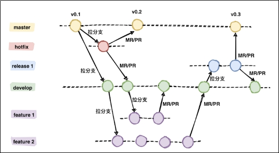

# GIT分支操作
## 为什么需要分支
- 同时并行推进多个功能开发，提高开发效率
- 各个分支开发过程中，若某一个分支失败，不会对其他分支产生影响，失败分支删除重开即可

## GIT FLOW
使用git开发的工作流程
### 集中式工作流
所有修改都提交到 Master 这个分支。不推荐使用，对主分支影响较大。  
svn工具采取这种模式。  


### 功能开发工作流
从主分支，拆分出专门的功能分支，仅在功能分支上开发，开发后合并（pull request）到主分支。  
对于规模不大要求不高的项目，可以使用这种模式。  


### GitFlow工作流+fork
在此种工作流上，包含以下主要分支：
- master：主干分支，用于上线发布使用的分支，开发者不应直接在主干分支上做修改。
- develop：开发分支，项目负责人从主分支拉取，从其他分支合并代码，并将最终通过测试验证的代码合并到预发布分支。
- hotfix：热修复分支，从主分支拉取，用于修复已发布版本的漏洞，hotfix的分支需要合并到主分支和开发分支上。
- release：预发布/测试分支，从开发分支拉取，用于测试或者预发布使用，并最终合并到主分支。
- feature：功能分支，开发人员从开发分支拉取，实际进行修改的分支，所有的功能分支改动最终都需要合并到开发分支。


fork,各个分支均使用fork创建，团队不同的角色分管不同的分支。并进行pull request处理。  


## 分支操作
### 创建分支
命令：git branch 分支名
```shell
xxx@DESKTOP MINGW64 /d/othergitrepository/data-struct (master)
$ git branch hot_fix
```

### 查看分支
命令：git branch -v
```shell
xxx@DESKTOP MINGW64 /d/othergitrepository/data-struct (master)
$ git branch -v
  hot_fix 97c6b65 add be deleted file
* master  97c6b65 add be deleted file
```

### 切换分支
命令：git checkout 分支名
```shell
xxx@DESKTOP MINGW64 /d/othergitrepository/data-struct (master)
$ git checkout hot_fix
Switched to branch 'hot_fix'
M       del.txt
M       init.txt
M       second.txt

xxx@DESKTOP MINGW64 /d/othergitrepository/data-struct (hot_fix)
$ git branch -v
* hot_fix 97c6b65 add be deleted file
  master  97c6b65 add be deleted file
```
切换后，再次查看分支，可以发现当前已经指向hot_fix分支

### 合并分支
step1: 切换到接收合并的分支中
git checkout 接收合并的分支名

step2: 合并分支
git merge 存在新内容的分支名
举例，先修改hot_fix分支中的init.txt文件，修改后查看分支，hot_fix分支已经变更：
```shell
xxx@DESKTOP MINGW64 /d/othergitrepository/data-struct (hot_fix)
$ vim init.txt

xxx@DESKTOP MINGW64 /d/othergitrepository/data-struct (hot_fix)
$ git add init.txt

xxx@DESKTOP MINGW64 /d/othergitrepository/data-struct (hot_fix)
$ git commit -m "hot fix modify" init.txt
[hot_fix f73f27e] hot fix modify
 1 file changed, 2 insertions(+), 1 deletion(-)

xxx@DESKTOP MINGW64 /d/othergitrepository/data-struct (hot_fix)
$ git branch -v
* hot_fix f73f27e hot fix modify
  master  97c6b65 add be deleted file
```
切换到主分支：
```shell
xxx@DESKTOP MINGW64 /d/othergitrepository/data-struct (hot_fix)
$ git checkout master
Switched to branch 'master'
M       del.txt
M       second.txt

xxx@DESKTOP MINGW64 /d/othergitrepository/data-struct (master)
$ git branch -v
  hot_fix f73f27e hot fix modify
* master  97c6b65 add be deleted file
```

将hot_fix分支内容合并到主分支,合并后查看：
```shell
xxx@DESKTOP MINGW64 /d/othergitrepository/data-struct (master)
$ git merge hot_fix
Updating 97c6b65..f73f27e
Fast-forward
 init.txt | 3 ++-
 1 file changed, 2 insertions(+), 1 deletion(-)

xxx@DESKTOP MINGW64 /d/othergitrepository/data-struct (master)
$ cat init.txt
this is the first file.
77 second line info add.
edit in hot_fix
```

### 合并冲突解决
当两个文件的相同部分进行了不同修改，在合并时会产生冲突，举例如下，将master和hot_fix分支的init.txt的最后一行分别修改：
master分支init.txt文件修改：
```shell
xxx@DESKTOP MINGW64 /d/othergitrepository/data-struct (master)
$ git branch -v
  hot_fix f73f27e hot fix modify
* master  f73f27e hot fix modify

xxx@DESKTOP MINGW64 /d/othergitrepository/data-struct (master)
$ vim init.txt

xxx@DESKTOP MINGW64 /d/othergitrepository/data-struct (master)
$ git add init.txt

xxx@DESKTOP MINGW64 /d/othergitrepository/data-struct (master)
$ git commit -m "master add content for init.txt" init.txt
[master 9be0b6a] master add content for init.txt
 1 file changed, 1 insertion(+)

xxx@DESKTOP MINGW64 /d/othergitrepository/data-struct (master)
$ cat init.txt
this is the first file.
77 second line info add.
edit in hot_fix
add by master
```
hot_fix分支init.txt文件修改：
```shell
xxx@DESKTOP MINGW64 /d/othergitrepository/data-struct (master)
$ git checkout hot_fix
Switched to branch 'hot_fix'
M       del.txt
M       second.txt

xxx@DESKTOP MINGW64 /d/othergitrepository/data-struct (hot_fix)
$ vim init.txt

xxx@DESKTOP MINGW64 /d/othergitrepository/data-struct (hot_fix)
$ git add init.txt

xxx@DESKTOP MINGW64 /d/othergitrepository/data-struct (hot_fix)
$ git commit -m "hotfix add content for init.txt" init.txt
[hot_fix 21a544c] hotfix add content for init.txt
 1 file changed, 1 insertion(+)

xxx@DESKTOP MINGW64 /d/othergitrepository/data-struct (hot_fix)
$ cat init.txt
this is the first file.
77 second line info add.
edit in hot_fix
add by hot_fix
```
尝试将master的改动合并到hot_fix,将会出现提示信息进入手动合并状态，hot_fix分支后会出现“|merging”:
```shell
xxx@DESKTOP MINGW64 /d/othergitrepository/data-struct (hot_fix)
$ git branch -v
* hot_fix ca85760 del.txt modify commit
  master  9be0b6a master add content for init.txt

xxx@DESKTOP MINGW64 /d/othergitrepository/data-struct (hot_fix)
$ git status
On branch hot_fix
nothing to commit, working tree clean

xxx@DESKTOP MINGW64 /d/othergitrepository/data-struct (hot_fix)
$ git merge master
Auto-merging init.txt
CONFLICT (content): Merge conflict in init.txt
Automatic merge failed; fix conflicts and then commit the result.

xxx@DESKTOP MINGW64 /d/othergitrepository/data-struct (hot_fix|MERGING)
```
进入提示冲突的init.txt文件：
```shell
xxx@DESKTOP MINGW64 /d/othergitrepository/data-struct (hot_fix|MERGING)
$ vim init.txt
```
文件内容如下,从“<<<<<<< HEAD”到“=======”部分为当前分支hot_fix当前最新指针处的修改，  
从“=======”到“>>>>>>> master”部分为master分支最新指针处的修改：
```
this is the first file.
77 second line info add.
edit in hot_fix
<<<<<<< HEAD
add by hot_fix
=======
add by master
>>>>>>> master
```
对如上文件手动合并，去除冲突的关键字,两行数据均做保留：
```
this is the first file.
77 second line info add.
edit in hot_fix
add by hot_fix
add by master
```
修改后，使用git status命令查看当前hot_fix分支中的状态,提示需要使用git add命令将手动合并的文件标记为已解决:
```shell
xxx@DESKTOP MINGW64 /d/othergitrepository/data-struct (hot_fix|MERGING)
$ git status
On branch hot_fix
You have unmerged paths.
  (fix conflicts and run "git commit")
  (use "git merge --abort" to abort the merge)

Unmerged paths:
  (use "git add <file>..." to mark resolution)
        both modified:   init.txt

no changes added to commit (use "git add" and/or "git commit -a")
```
使用git add命令将合并的文件提交到暂存区后，当前hot_fix分支仍旧处于merging状态，使用git status命令查看，提示需要使用git commit命令将文件提交来给出合并结论，完成冲突解决：
```shell
xxx@DESKTOP MINGW64 /d/othergitrepository/data-struct (hot_fix|MERGING)
$ git add init.txt

xxx@DESKTOP MINGW64 /d/othergitrepository/data-struct (hot_fix|MERGING)
$ git status
On branch hot_fix
All conflicts fixed but you are still merging.
  (use "git commit" to conclude merge)

Changes to be committed:
        modified:   init.txt
```
注意，解决冲突阶段的git commit为全量提交，不能只提交部分文件,否则git会给出提示信息。  
```shell
xxx@DESKTOP MINGW64 /d/othergitrepository/data-struct (hot_fix|MERGING)
$ git commit -m "finish manual merge"
[hot_fix be24ddc] finish manual merge

xxx@DESKTOP MINGW64 /d/othergitrepository/data-struct (hot_fix)
$ git status
On branch hot_fix
nothing to commit, working tree clean
```
合并后，hot_fix分支从merging状态恢复，git status命令提示无待提交内容。