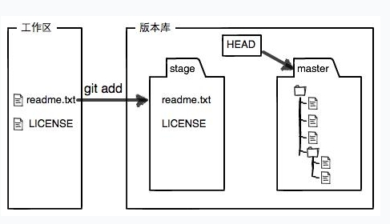
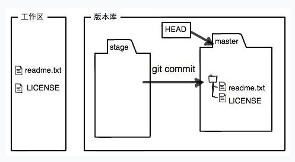

# GIT基本原理
## GIT文件存放流程
工作区（Working Directory）：文件目录

版本库（Repository）：工作区中的隐藏目录.git，该目录不属于工作区

暂存区（stage/index）：通过git add命令可以将工作区中的文件放置到暂存区，并且只有放入暂存区的文件才能进行版本控制。



分支：例如git init命令自动创建的master分支，暂存区中的文件通过git commit命令提交到分支，进入分支后的文件才算真正能被版本控制管理，进行版本穿梭。



## 文件一致性和完整性校验
git采用散列（hash）确定文件的一致性和完整性。  
相同文件的hash值相同，如果hash值不同，表明文件已被篡改或者被损坏。  

## GIT保存版本的机制
GIT使用快照索引的方式对不同版本的文件进行存储。  
如果两个版本间文件没有变化，则通过指针进行指向，不会冗余存储文件。    
如果两个版本间文件变更，则两个版本分别保存一份完整的数据快照。  
每个快照间都会使用树+父节点的结构对各个版本的快照进行连接。

## GIT分支管理机制
GIT创建分支并不会完全复制一份全量的文件数据，而是创建指针指向一个新的分支索引。   
```
                          HEAD
                           |
                          \|/
                        <master>
                           |
                          \|/
[abc123]<---[tgb234]<---[9gjhr5]
                          /|\
                           |
                       <hot_fix>
                          /|\
                           |             
                          HEAD
```

不同分支间的修改，实际也是指针的操作,例如如果基于上图，master分支执行了新的提交，则可以使用如下图来理解：
```
                                      HEAD
                                       |
                                      \|/
                                    <master>
                                       |
                                      \|/
[abc123]<---[tgb234]<---[9gjhr5]<---[e3wsa2]
                          /|\
                           |
                       <hot_fix>
                          /|\
                           |             
                          HEAD
```
当hot_fix和master分支都进行了修改，并且出现差异时，版本会出现分叉(版本和数据)：
```
                                      HEAD
                                       |
                                      \|/
                                    <master>
                                       |
                                      \|/
[abc123]<---[tgb234]<---[9gjhr5]<---[e3wsa2]
                          /|\
                           |
                           --------[tt56y7]
                                      /|\
                                       |
                                   <hot_fix>
                                      /|\
                                       |             
                                      HEAD
```
当不同分支切换时，只需要通过切换指针即可。