# 6 GITHUB远程库操作
注意，多用户操作时，用户的email不能相同，否则会被认为同一人提交。
## 6.1 用户1创建本地库
使用leekiu作为当前库的提交者，初始化git工程后，创建readme.txt文件，提交到本地库
```shell
xxx@DESKTOP MINGW64 /d/othergitrepository/gh-project
$ git init
Initialized empty Git repository in D:/othergitrepository/gh-project/.git/

xxx@DESKTOP MINGW64 /d/othergitrepository/gh-project (master)
$ git config user.name leekiu

xxx@DESKTOP MINGW64 /d/othergitrepository/gh-project (master)
$ git config user.email liecholin@163.com

xxx@DESKTOP MINGW64 /d/othergitrepository/gh-project (master)
$ vim readme.txt

xxx@DESKTOP MINGW64 /d/othergitrepository/gh-project (master)
$ git add readme.txt
warning: in the working copy of 'readme.txt', LF will be replaced by CRLF the next time Git touches it

xxx@DESKTOP MINGW64 /d/othergitrepository/gh-project (master)
$ git commit -m "first commit" readme.txt
warning: in the working copy of 'readme.txt', LF will be replaced by CRLF the next time Git touches it
[master (root-commit) a77be73] first commit
 1 file changed, 1 insertion(+)
 create mode 100644 readme.txt
```
## 6.2 用户1创建远程库
在github上创建账号并登录，创建远程库，远程库和本地库的名称不必一致，但建议一致：

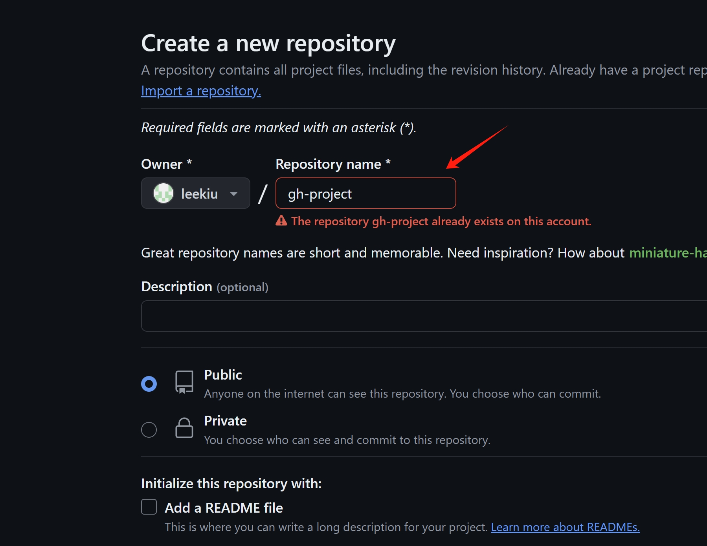
创建远程库后，本地设置远程库地址（远程库地址可以在github上获取,设置的名字“origin”可以修改）：
```shell
xxx@DESKTOP MINGW64 /d/othergitrepository/gh-project (master)
$ git remote -v

xxx@DESKTOP MINGW64 /d/othergitrepository/gh-project (master)
$ git remote add origin https://github.com/leekiu/gh-project.git

xxx@DESKTOP MINGW64 /d/othergitrepository/gh-project (master)
$ git remote -v
origin  https://github.com/leekiu/gh-project.git (fetch)
origin  https://github.com/leekiu/gh-project.git (push)

```

## 6.3 用户1本地库推送远程库
注意，推送阶段开发者需要进行GITHUB的账户授权，选择适当的方式授权即可。
```shell
xxx@DESKTOP MINGW64 /d/othergitrepository/gh-project (master)
$ git push origin master
Enumerating objects: 3, done.
Counting objects: 100% (3/3), done.
Writing objects: 100% (3/3), 213 bytes | 213.00 KiB/s, done.
Total 3 (delta 0), reused 0 (delta 0), pack-reused 0 (from 0)
To https://github.com/leekiu/gh-project.git
 * [new branch]      master -> master
```
注意：推送操作可以加上-u参数, 一般用于第一次推送，可以将本地master分支和远程master分支关联，可简化后续的拉去和推送命令
```shell
git push -u origin master
```

## 6.4 用户2克隆远程库
在github获取远程库地址，使用git clone命令克隆：
```shell
xxx@DESKTOP MINGW64 /d/othergitrepository/gh-project-ChoAh
$ git clone https://github.com/leekiu/gh-project.git
Cloning into 'gh-project'...
remote: Enumerating objects: 3, done.
remote: Counting objects: 100% (3/3), done.
remote: Total 3 (delta 0), reused 3 (delta 0), pack-reused 0
Receiving objects: 100% (3/3), done.
```
克隆后进入目录查看：
```shell
xxx@DESKTOP MINGW64 /d/othergitrepository/gh-project-ChoAh
$ cd gh-project/

xxx@DESKTOP MINGW64 /d/othergitrepository/gh-project-ChoAh/gh-project (master)
$ git remote -v
origin  https://github.com/leekiu/gh-project.git (fetch)
origin  https://github.com/leekiu/gh-project.git (push)
```
克隆命令将帮助开发者完成如下三部分操作：
- 完整把远程库下载至本地
- 创建远程地址别名（本文为origin）
- 初始化本地库

## 6.5 删除远端分支
删除前可以检查分支，使用如下命令：
```shell
git branch -r
# 或查看所有分支
git branch -a
```
解绑本地和远端分支：
```shell
git remote rm origin
```
删除远端分支并推送（操作不可逆）：
```shell
git push origin --delete <branch-name>
# 或使用简化版本
git push origin :<branch-name>
```
删除已被清理的远端分支引用
```shell
git fetch --prune
```

## 6.6 用户2被用户1邀请进项目
用户2克隆后，可以进入本地库对文件进行操作并提交，但是如果用户2未被加入到用户1创建的远程库项目成员组中，推送操作将被限制。  
在GITHUB上进入项目，在项目的settings页下可以通过“collaborators”功能添加合作者：
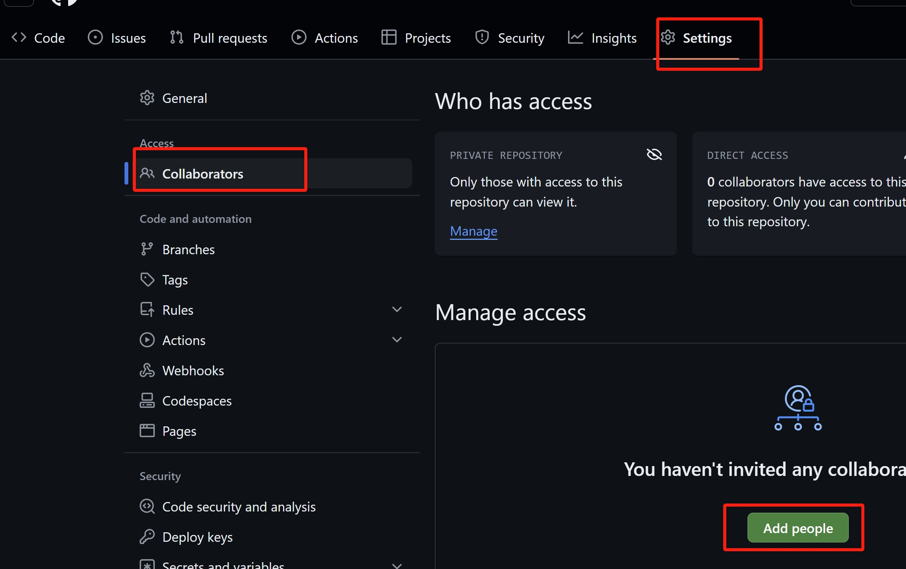
用户2需要登录github,并在消息中处理接受合作邀请，接收后方可进行远程库推送。


## 6.7 用户2本地操作文件并推送到远程库
用户2被邀请项目后，除本地库的操作外，也可以进行推送操作：
```shell
xxx@DESKTOP MINGW64 /d/othergitrepository/gh-project-ChoAh/gh-project (master)
$ vim
.git/       readme.txt

xxx@DESKTOP MINGW64 /d/othergitrepository/gh-project-ChoAh/gh-project (master)
$ vim readme.txt

xxx@DESKTOP MINGW64 /d/othergitrepository/gh-project-ChoAh/gh-project (master)
$ git add readme.txt

xxx@DESKTOP MINGW64 /d/othergitrepository/gh-project-ChoAh/gh-project (master)
$ git commit -m "commit by choah" readme.txt
[master aa0f940] commit by choah
 1 file changed, 1 insertion(+)

xxx@DESKTOP MINGW64 /d/othergitrepository/gh-project-ChoAh/gh-project (master)
$ git push origin master
Enumerating objects: 5, done.
Counting objects: 100% (5/5), done.
Writing objects: 100% (3/3), 263 bytes | 263.00 KiB/s, done.
Total 3 (delta 0), reused 0 (delta 0), pack-reused 0 (from 0)
To https://github.com/leekiu/gh-project.git
   a77be73..aa0f940  master -> master
```
注意，如果推送提示需要进行远程账户关联，选择适当的方式授权即可。

## 6.8 用户1远程拉去用户2的提交
拉去操作可以使用git pull 也可以使用git fetch + git merge进行分步操作
### 6.8.1 git fetch + git merge
使用“git fetch 远程库 远程库分支名”拉取，注意此时的拉取仅拉取到本地的远程分支中，并没有真正合并到本地库，只进行fetch，在本地库中看不到文件的变化：
```shell
xxx@DESKTOP MINGW64 /d/othergitrepository/gh-project (master)
$ git fetch origin master
remote: Enumerating objects: 5, done.
remote: Counting objects: 100% (5/5), done.
remote: Total 3 (delta 0), reused 3 (delta 0), pack-reused 0
Unpacking objects: 100% (3/3), 243 bytes | 3.00 KiB/s, done.
From https://github.com/leekiu/gh-project
 * branch            master     -> FETCH_HEAD
   a77be73..aa0f940  master     -> origin/master

xxx@DESKTOP MINGW64 /d/othergitrepository/gh-project (master)
$ cat readme.txt
readme
```
切换到本地的远程库分支，可以看到fetch文件的变化：
```shell
xxx@DESKTOP MINGW64 /d/othergitrepository/gh-project (master)
$ git checkout origin/master
Note: switching to 'origin/master'.

You are in 'detached HEAD' state. You can look around, make experimental
changes and commit them, and you can discard any commits you make in this
state without impacting any branches by switching back to a branch.

If you want to create a new branch to retain commits you create, you may
do so (now or later) by using -c with the switch command. Example:

  git switch -c <new-branch-name>

Or undo this operation with:

  git switch -

Turn off this advice by setting config variable advice.detachedHead to false

HEAD is now at aa0f940 commit by choah

xxx@DESKTOP MINGW64 /d/othergitrepository/gh-project ((aa0f940...))
$ cat readme.txt
readme
edit by choah
```
再次切换到本地库，进行合并,合并完成后可以看到本地库已经成功拉取和合并远程库的文件：
合并命令：git fetch 远程库/远程库分支名
```shell
xxx@DESKTOP MINGW64 /d/othergitrepository/gh-project ((aa0f940...))
$ git checkout master
Previous HEAD position was aa0f940 commit by choah
Switched to branch 'master'

xxx@DESKTOP MINGW64 /d/othergitrepository/gh-project (master)
$ cat readme.txt
readme

xxx@DESKTOP MINGW64 /d/othergitrepository/gh-project (master)
$ git merge origin/master
Updating a77be73..aa0f940
Fast-forward
 readme.txt | 1 +
 1 file changed, 1 insertion(+)

xxx@DESKTOP MINGW64 /d/othergitrepository/gh-project (master)
$ cat readme.txt
readme
edit by choah
```
使用fetch+merge 可以先查看拉取的文件是否存在问题，再进行合并

### 6.8.2 git pull
git pull可以简化上述的操作，一步完成拉取和合并,(此时用户2已经再次修改文件)：
```shell
xxx@DESKTOP MINGW64 /d/othergitrepository/gh-project (master)
$ git pull origin master
remote: Enumerating objects: 5, done.
remote: Counting objects: 100% (5/5), done.
remote: Total 3 (delta 0), reused 3 (delta 0), pack-reused 0
Unpacking objects: 100% (3/3), 244 bytes | 4.00 KiB/s, done.
From https://github.com/leekiu/gh-project
 * branch            master     -> FETCH_HEAD
   aa0f940..80d6310  master     -> origin/master
Updating aa0f940..80d6310
Fast-forward
 readme.txt | 2 +-
 1 file changed, 1 insertion(+), 1 deletion(-)

xxx@DESKTOP MINGW64 /d/othergitrepository/gh-project (master)
$ cat readme.txt
readme
edit by ChoAhChoAh
```
## 6.9 远程库提交冲突解决
提交阶段，如果git检查本地库不是最新，则不予提交，需要先进行拉取操作，拉去后如果出现冲突，需要按照“4.GIT分支操作”中的冲突解决方法，解决冲突后再提交和推送。

## 6.10 跨团队协作开发
### 6.10.1 fork项目
在跨团队协作开发的背景下，不同项目组的开发人员可能针对同一个项目代码fork不同的代码仓库，再通过pull request,将fork仓库的修改合并到原始仓库上。  
fork操作：
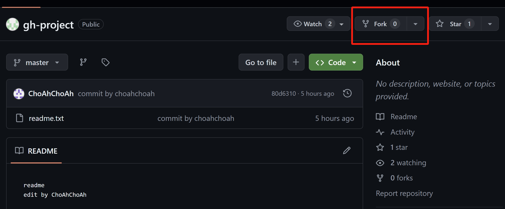
在进入fork页面后，填写项目名即可。  
fork工程后，同样通过git clone命令，将fork的远程仓库克隆到本地。  
克隆后进行修改，再通过git add -> git commit -> git push等一些列命令，将修改推送到远端的fork仓库。 

### 6.10.2 本地账号连接问题
注意，如果本地使用https连接clone远端仓库，并且有多个github账号，请在windows的凭据管理器中查看当前登陆的账号是否为fork仓库对应的账号，  
若账号不一致，请删除凭据，并且在git push阶段重新登陆授权。
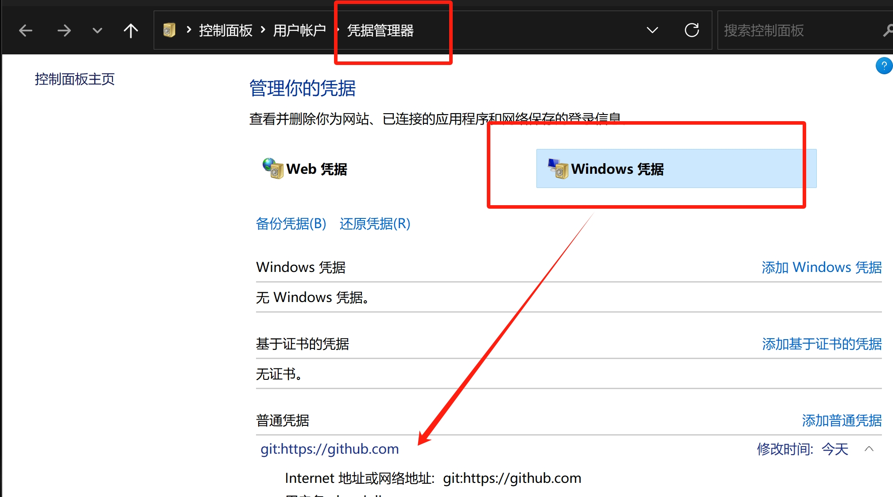

### 6.10.3 发起pull request请求将改动合并到原始远程库
在github fork的项目中，提交pull request
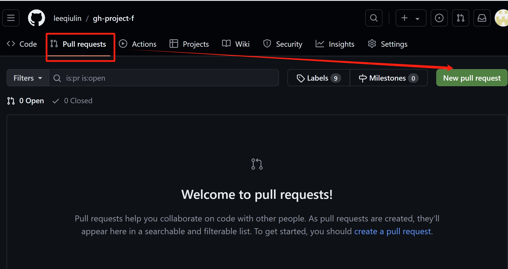
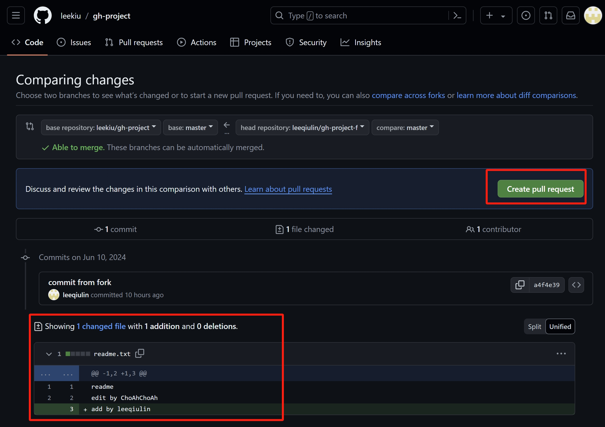
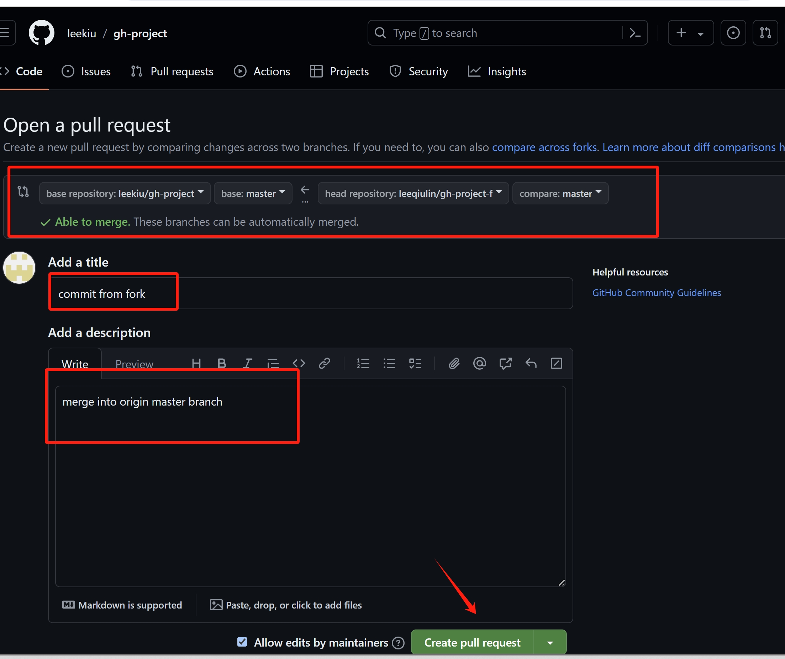

### 6.10.4 切换github登陆账号，接受pull request
切换账号，使用原始远程库的账户登陆github，查看并接受pull request
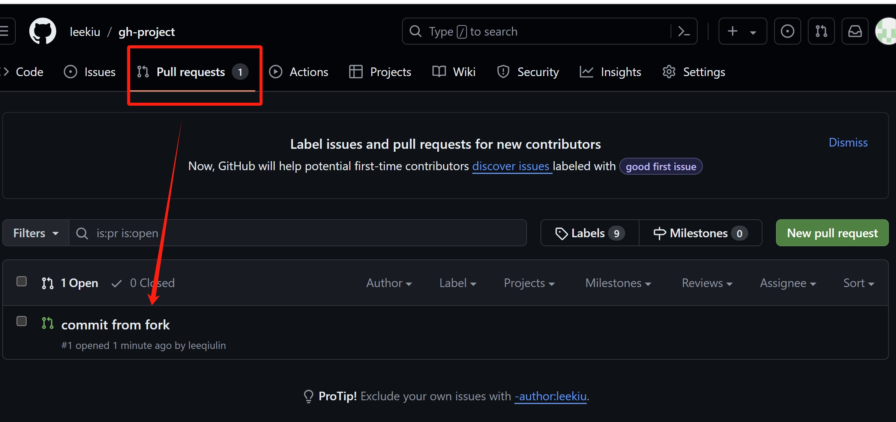
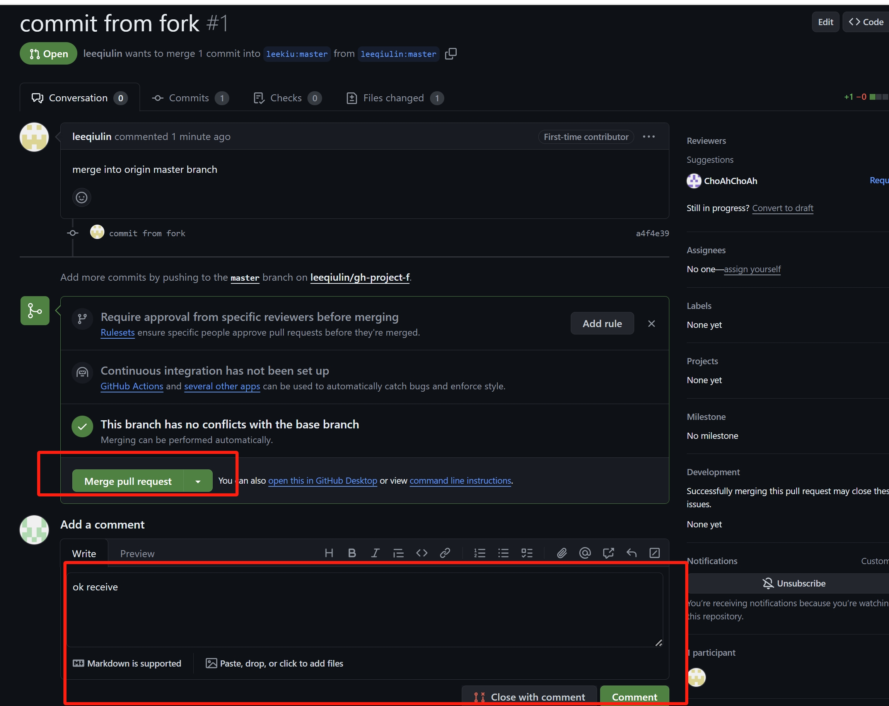
接受后，可以查看到合并的内容
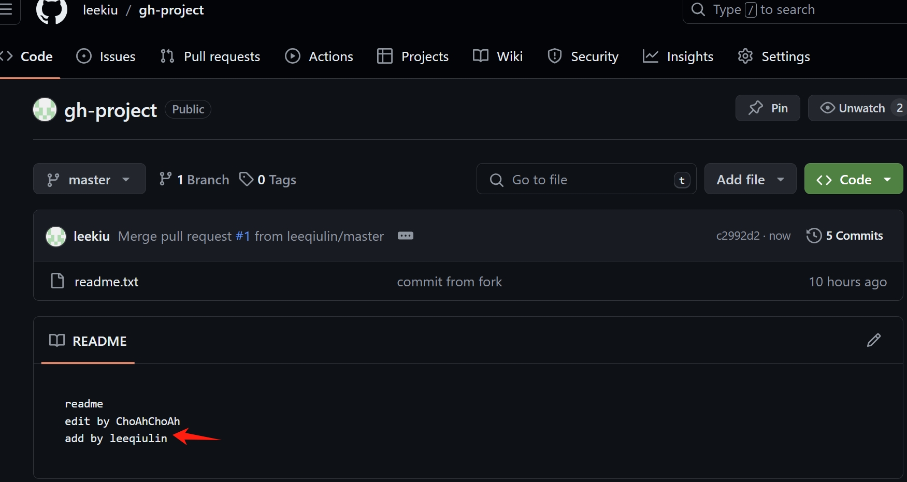

### 6.10.5 拉取原始远程库，查看改动
```shell
xxx@DESKTOP MINGW64 /d/othergitrepository/gh-project-ChoAh/gh-project (master)
$ git pull origin master
remote: Enumerating objects: 6, done.
remote: Counting objects: 100% (6/6), done.
remote: Compressing objects: 100% (2/2), done.
remote: Total 4 (delta 0), reused 3 (delta 0), pack-reused 0
Unpacking objects: 100% (4/4), 1.11 KiB | 19.00 KiB/s, done.
From https://github.com/leekiu/gh-project
 * branch            master     -> FETCH_HEAD
   80d6310..c2992d2  master     -> origin/master
Updating 80d6310..c2992d2
Fast-forward
 readme.txt | 1 +
 1 file changed, 1 insertion(+)

xxx@DESKTOP MINGW64 /d/othergitrepository/gh-project-ChoAh/gh-project (master)
$ cat readme.txt
readme
edit by ChoAhChoAh
add by leeqiulin
```


## 6.11 SSH凭据验证
使用https和远端仓库交互需要登陆用户，开发者可以使用ssh的方式和远端仓库进行交互，但需要先在本地和github上设置ssh凭证。  
注意，ssh凭证针对一个系统登陆用户只能设置一个。  
### 6.11.1 本地设置SSH凭据
进入用户家目录，使用如下命令设置凭据：
```shell
xxx@DESKTOP MINGW64 ~
$ ssh-keygen -t rsa -C liecholin@163.com
Generating public/private rsa key pair.
Enter file in which to save the key (/c/Users/liecho/.ssh/id_rsa):
Created directory '/c/Users/liecho/.ssh'.
Enter passphrase (empty for no passphrase):
Enter same passphrase again:
Your identification has been saved in /c/Users/liecho/.ssh/id_rsa
Your public key has been saved in /c/Users/liecho/.ssh/id_rsa.pub
The key fingerprint is:
SHA256:8oevhFaHDH29WHzoVAyGfmQth+UWLDm7Zj54H/ZS+js liecholin@163.com
The key's randomart image is:
+---[RSA 3072]----+
|           .oO+  |
|       .  .+O+=. |
|      . ...o**+  |
|       o o.=o+   |
|      . S o.o.   |
|       = o  +   .|
|      o + .=  oo |
|     . . o. +.oE |
|        .... o.+=|
+----[SHA256]-----+
```
设置本地凭据后，进入用户家目录的.ssh目录，获取凭据字符串：
```shell
xxx@DESKTOP MINGW64 ~
$ cd .ssh

xxx@DESKTOP MINGW64 ~/.ssh
$ ls
id_rsa  id_rsa.pub

xxx@DESKTOP MINGW64 ~/.ssh
$ cat id_rsa.pub
## 此处将打印凭据字符串
```

### 6.11.2 在远程仓库设置ssh凭据
GITHUB上通过用户进入setting界面：
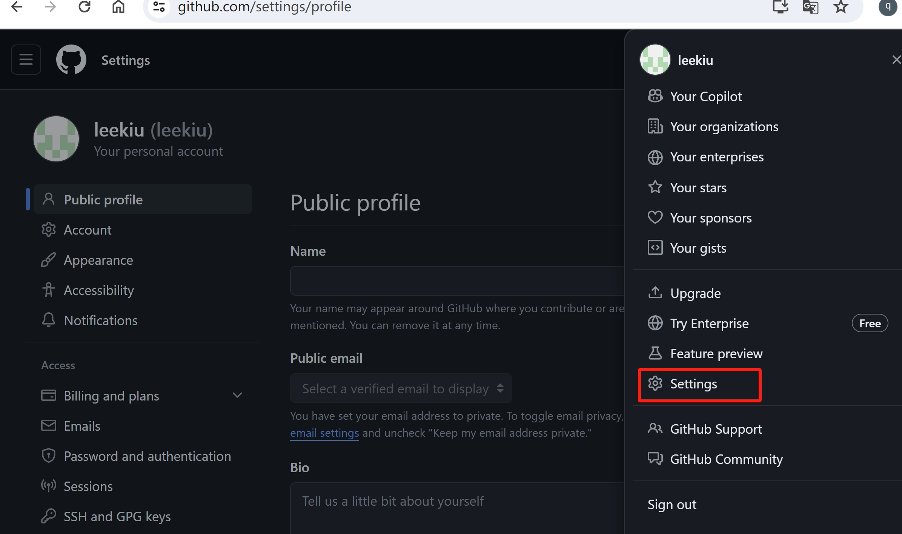
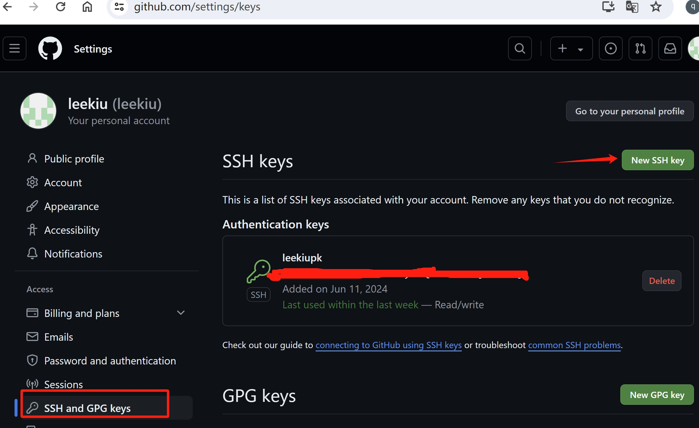

在上一节重获取的ssh key填入下方界面中，保存即可
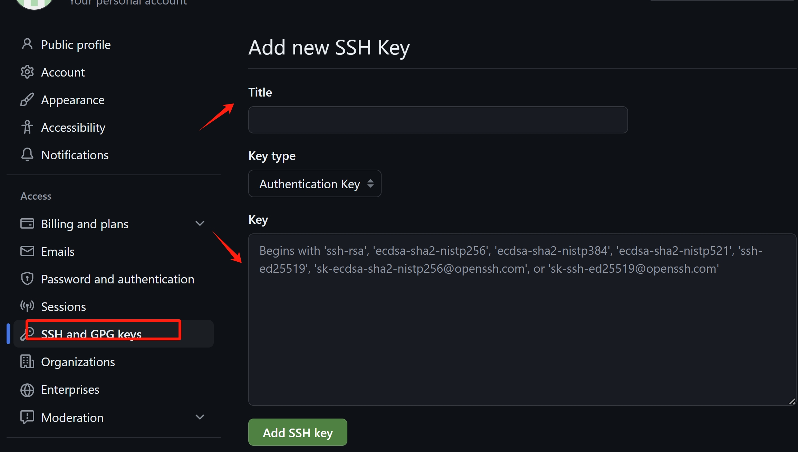

### 6.11.3 本地创建ssh远程源
使用git remote add，创建ssh的远程源，地址从github获取
```shell
xxx@DESKTOP MINGW64 /d/othergitrepository/gh-project-ChoAh/gh-project (master)
$ git remote add origin_ssh git@github.com:leekiu/gh-project.git

xxx@DESKTOP MINGW64 /d/othergitrepository/gh-project-ChoAh/gh-project (master)
$ git remote -v
origin  https://github.com/leekiu/gh-project.git (fetch)
origin  https://github.com/leekiu/gh-project.git (push)
origin_ssh      git@github.com:leekiu/gh-project.git (fetch)
origin_ssh      git@github.com:leekiu/gh-project.git (push)
```
创建后即可使用ssh的远程源进行推送：
```shell
xxx@DESKTOP MINGW64 /d/othergitrepository/gh-project-ChoAh/gh-project (master)
$ git push origin_ssh master
The authenticity of host 'github.com (20.205.243.166)' can't be established.
ED25519 key fingerprint is SHA256:+DiY3wvvV6TuJJhbpZisF/zLDA0zPMSvHdkr4UvCOqU.
This key is not known by any other names.
Are you sure you want to continue connecting (yes/no/[fingerprint])? yes
Warning: Permanently added 'github.com' (ED25519) to the list of known hosts.
Enumerating objects: 5, done.
Counting objects: 100% (5/5), done.
Delta compression using up to 12 threads
Compressing objects: 100% (2/2), done.
Writing objects: 100% (3/3), 282 bytes | 282.00 KiB/s, done.
Total 3 (delta 0), reused 0 (delta 0), pack-reused 0 (from 0)
To github.com:leekiu/gh-project.git
   c2992d2..b4009dd  master -> master
```