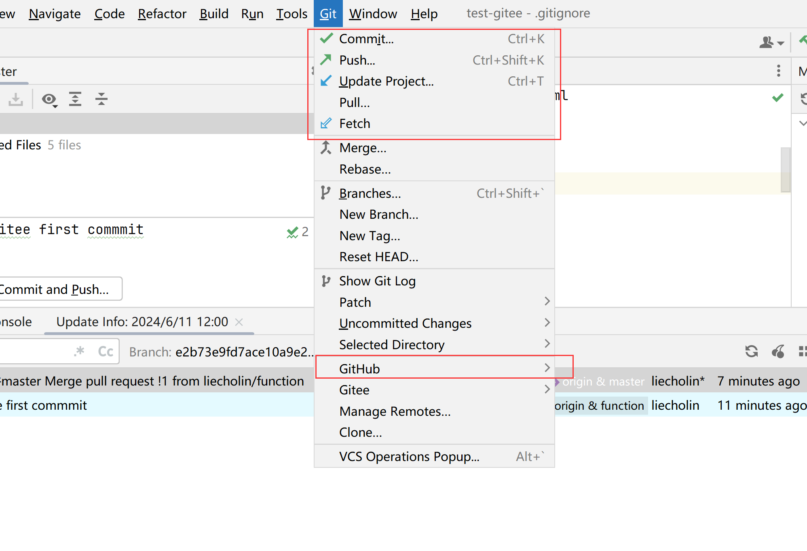
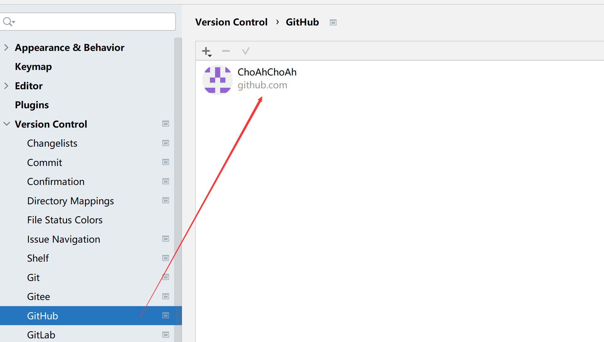
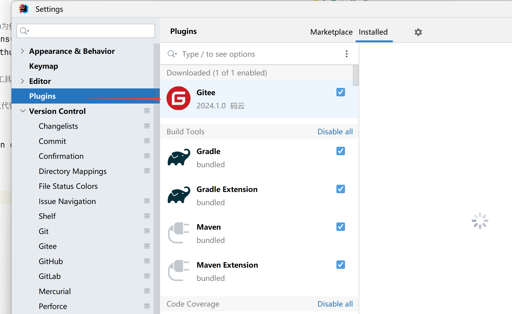
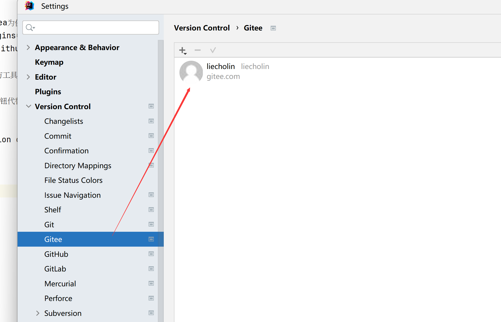

# GITHUB界面操作
## idea
如需使用可视化编译器操作git,以idea为例，需要安装git相关插件：
在idea->file->settings->plugins中，查看已安装的git插件。  
idea 2019版本已经默认安装git、github、gitlab插件，可以直接使用。  

再idea中，git的相关操作在程序上方工具栏中。  

工具菜单中包含了众多可视化的操作按钮代替命令行。也可以设置快捷键（例如：ctrl+shift+k为默认的推送操作快捷键）

### github
在idea->file->settings-version control->github中可以设置用于连接远程库的账户。  

也可以设置ssh方式。

### gitee
在idea->file->settings->plugins中，需要安装gitee的插件：

安装后，在idea->file->settings-version control->gitee中设置远程库连接账号，也可以在首次推送时进行登录操作
